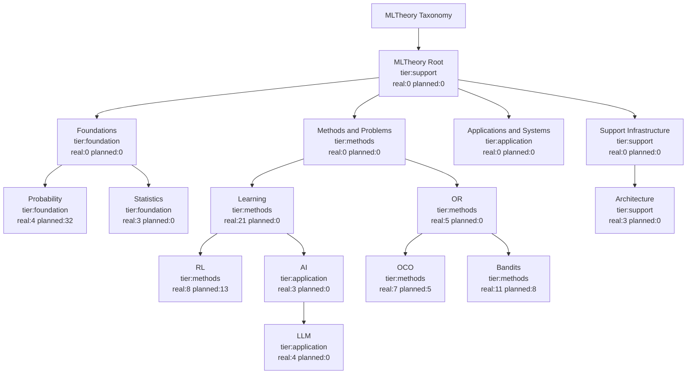

# 工具森林（Tool Forest）

<!-- GENERATED FROM docs/ssot/registry.json. DO NOT EDIT MANUALLY. -->

## 一眼看懂
- 真实模块数：69
- 规划模块数：58
- 规划执行短清单：1
- 规划未排期：57
- taxonomy 节点数：15
- 真实模块角色：canonical=7，tool=44，compat=2，bridge=16，placeholder=0
- 真实模块证明状态：proved=48，statement=21，placeholder=0
- `Books/Legacy` 已改为 `source_track` 轴，不再作为主树节点。

## 视图 A：Taxonomy 主树

## 表 1：taxonomy 节点总览
| node_id | node_name | tier | primary_parent_id | real_modules | planned_modules | canonical | tool |
|---|---|---|---|---|---|---|---|
| learning | Learning | methods | methods_problems | 21 | 0 | 6 | 11 |
| bandits | Bandits | methods | or | 11 | 8 | 1 | 9 |
| rl | RL | methods | learning | 8 | 13 | 0 | 4 |
| oco | OCO | methods | or | 7 | 5 | 0 | 6 |
| or | OR | methods | methods_problems | 5 | 0 | 0 | 4 |
| probability | Probability | foundation | foundations | 4 | 32 | 0 | 3 |
| llm | LLM | application | ai | 4 | 0 | 0 | 3 |
| ai | AI | application | learning | 3 | 0 | 0 | 2 |
| architecture | Architecture | support | support_infrastructure | 3 | 0 | 0 | 0 |
| statistics | Statistics | foundation | foundations | 3 | 0 | 0 | 2 |
| applications_systems | Applications and Systems | application | ml_root | 0 | 0 | 0 | 0 |
| foundations | Foundations | foundation | ml_root | 0 | 0 | 0 | 0 |
| methods_problems | Methods and Problems | methods | ml_root | 0 | 0 | 0 | 0 |
| ml_root | MLTheory Root | support | root | 0 | 0 | 0 | 0 |
| support_infrastructure | Support Infrastructure | support | ml_root | 0 | 0 | 0 | 0 |

## 表 2：关系边（次父/关联）
| from_node | from_name | to_node | to_name | relation_type | strength |
|---|---|---|---|---|---|
| statistics | Statistics | probability | Probability | related | 0.8 |
| rl | RL | ai | AI | related | 0.6 |
| bandits | Bandits | rl | RL | related | 0.8 |

## 表 3：source_track 分布（真实/规划）
| source_track | real_modules | planned_modules |
|---|---|---|
| native | 67 | 21 |
| books | 2 | 37 |
| legacy | 0 | 0 |

## 表 4：入口模块（canonical + tool，Top 20）
- 全量入口数：51（这里默认只展示前 20 条，详细请看交互页）
| module_path | node_name | source_track | layer | role | proof_status | formal_decl_refs |
|---|---|---|---|---|---|---|
| MLTheory.Applications.AI.DecisionLearning | AI | native | applications | tool | proved | DecisionLearningScenario, policyImprovementGap, policyImprovementGap_nonneg_of_le, ...(+5) |
| MLTheory.Applications.AI.Generalization | AI | native | applications | tool | proved | AIGeneralizationScenario, deploymentGap, deploymentGap_nonneg_of_le, ...(+2) |
| MLTheory.Applications.LLM.AlignmentObjectives | LLM | native | applications | tool | proved | AlignmentObjective, preferenceMargin, preferenceMargin_nonneg_of_le, ...(+5) |
| MLTheory.Applications.LLM.Autoregressive | LLM | native | applications | tool | proved | AutoregressiveModel, sequenceScore, autoregressiveRiskGap, ...(+2) |
| MLTheory.Applications.LLM.Sampling | LLM | native | applications | tool | proved | SamplingPolicy, sampledToken, samplingStepScore, ...(+5) |
| MLTheory.Core.Learning.Capacity | Learning | native | core | tool | proved | CapacityBridge, vcDimensionBound, rademacherBound |
| MLTheory.Core.Learning.FunctionClass | Learning | native | core | canonical | proved | HypothesisClass |
| MLTheory.Core.Learning.PAC | Learning | native | core | canonical | proved | PACProblem |
| MLTheory.Core.Probability.BasicMeasure | Probability | native | core | tool | proved | isMeasurableEvent, eventMass, eventMass_mono, ...(+3) |
| MLTheory.Core.Probability.Conditioning | Probability | native | core | tool | proved | conditionedEvent, conditionedEvent_subset_left, condWeight_nonneg |
| MLTheory.Core.Probability.ProbIneq | Probability | native | core | tool | proved | tailUpperEnvelope, tailUpperEnvelope_trans, tailUpperEnvelope_add, ...(+1) |
| MLTheory.Core.RL.MDP | RL | native | core | tool | statement | FiniteMDP, DeterministicPolicy, bellmanExpectationSpec, ...(+1) |
| MLTheory.Core.Statistics.Information | Statistics | native | core | tool | proved | InformationPair, klSurrogate, klSurrogate_nonneg_of_le, ...(+3) |
| MLTheory.Core.Statistics.Risk | Statistics | native | core | tool | proved | RiskPair, excessRisk, excessRisk_nonneg_of_le, ...(+1) |
| MLTheory.Methods.Bandits.Adversarial | Bandits | native | methods | tool | proved | AdversarialBanditModel, adversarialRoundRegret, adversarialRoundRegret_nonneg_of_le, ...(+6) |
| MLTheory.Methods.Bandits.BestArmIdentification | Bandits | native | methods | tool | proved | BAIProblem, simpleRegret, simpleRegret_nonneg_of_le, ...(+5) |
| MLTheory.Methods.Bandits.ContextualLinear | Bandits | native | methods | tool | proved | ContextualLinearBanditProblem, LinearScorer, predictedReward, ...(+8) |
| MLTheory.Methods.Bandits.Dueling | Bandits | native | methods | tool | proved | DuelingBanditProblem, duelAdvantage, duelAdvantage_swap_neg, ...(+6) |
| MLTheory.Methods.Bandits.Foundations | Bandits | native | methods | canonical | proved | BanditInstance, regret, regret_nonneg_of_le, ...(+2) |
| MLTheory.Methods.Bandits.InformationTheory | Bandits | native | methods | tool | proved | InformationBanditModel, klStyleBonus, klStyleBonus_nonneg, ...(+5) |

## 表 5：规划模块样例（Top 12）
- 全量规划模块数：58（这里只展示前 12 条，避免刷屏）
| module_path | target_node_name | source_track | status | execution_horizon | execution_priority | reason |
|---|---|---|---|---|---|---|
| MLTheory.Books.BanditAlgorithms | Bandits | books | planned | unscheduled | — | No local .lean file yet; keep as roadmap/planned module (layer=books,... |
| MLTheory.Books.BanditAlgorithms.PartIII_AdversarialBandits | Bandits | books | gap | unscheduled | — | No local .lean file yet; keep as roadmap/planned module (layer=books,... |
| MLTheory.Books.BanditAlgorithms.PartII_StochasticBandits | Bandits | books | planned | unscheduled | — | No local .lean file yet; keep as roadmap/planned module (layer=books,... |
| MLTheory.Books.BanditAlgorithms.PartIV_ContextualLinearBandits | Bandits | books | gap | unscheduled | — | No local .lean file yet; keep as roadmap/planned module (layer=books,... |
| MLTheory.Books.BanditAlgorithms.PartI_Foundations | Bandits | books | planned | unscheduled | — | No local .lean file yet; keep as roadmap/planned module (layer=books,... |
| MLTheory.Books.BanditAlgorithms.PartVII_ReinforcementLearning | Bandits | books | gap | unscheduled | — | No local .lean file yet; keep as roadmap/planned module (layer=books,... |
| MLTheory.Books.BanditAlgorithms.PartVI_PureExploration | Bandits | books | gap | unscheduled | — | No local .lean file yet; keep as roadmap/planned module (layer=books,... |
| MLTheory.Books.BanditAlgorithms.PartV_LargeActionSpaces | Bandits | books | gap | unscheduled | — | No local .lean file yet; keep as roadmap/planned module (layer=books,... |
| MLTheory.Books.Durrett5 | Probability | books | planned | unscheduled | — | No local .lean file yet; keep as roadmap/planned module (layer=books,... |
| MLTheory.Books.Durrett5.Ch01_MeasureTheory | Probability | books | planned | unscheduled | — | No local .lean file yet; keep as roadmap/planned module (layer=books,... |
| MLTheory.Books.Durrett5.Ch02_ProbabilityTheory | Probability | books | planned | unscheduled | — | No local .lean file yet; keep as roadmap/planned module (layer=books,... |
| MLTheory.Books.Durrett5.Ch03_IndependenceExpectations | Probability | books | planned | unscheduled | — | No local .lean file yet; keep as roadmap/planned module (layer=books,... |

## 表 6：规划执行短清单（near/mid/far）
| horizon | priority | module_path | target_node | why_now | done_when |
|---|---|---|---|---|---|
| near | P3 | MLTheory.Core.Probability.CLTBridge | Probability | BasicMeasure 已落地，继续补概率主线与极限定理连接层，服务上游 concentration 与... | 形成 CLT bridge 最小接口（标准化和、极限分布占位接口）并接入 ImportSmoke。 |

## 交互页（完整明细）
- 见 [ToolForestInteractive.html](./ToolForestInteractive.html)。
- 默认只显示 `真实模块`；需要时再切到 `规划模块`。
- 支持 `真实模块/规划模块` 开关、node/source/layer/role/proof/plan window 筛选与搜索。
- 想快速验收本轮变化：看 [ReviewDashboard.md](./ReviewDashboard.md)。
- 想快速理解模块用途：看 [APICards.md](./APICards.md)。

## 使用说明（人 + Codex）
1. 本文档由 `docs/ssot/registry.json` 自动生成，禁止手改。
2. 主树看 `taxonomy_nodes`，横向关系看 `taxonomy_relations`。
3. 真实结构看 `modules`；路线图看 `planned_modules`。
4. 变更流程：
- 先改 `docs/ssot/registry.json`。
- 跑 `python3 tools/docs/validate_ssot.py`。
- 跑 `python3 tools/docs/sync_docs.py --write`。
- 跑 `python3 tools/ci/check_taxonomy_contract.py`。
- 跑 `python3 tools/ci/check_tool_forest_consistency.py`。
