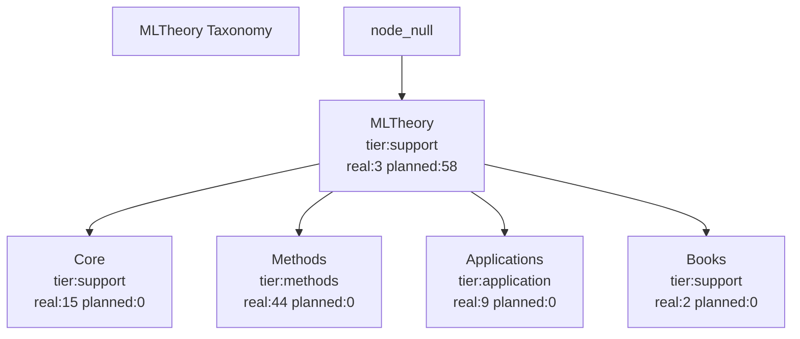

<!-- AUTO:DOC-DOCS_TOOLFOREST_MD BEGIN -->
# Tool forest(Tool Forest)

<!-- GENERATED FROM docs/ssot/registry.json. DO NOT EDIT MANUALLY. -->

## Understand at a glance
- Real number of modules:73
- Number of planning modules:58
- Planning Execution Short Checklist:1
- Planning is not scheduled:57
- taxonomy Number of nodes:5
- real module role:canonical=0,tool=73,compat=0,bridge=0,placeholder=0
- Real module proof status:proved=3,statement=70,placeholder=0
- `Books/Legacy` has been changed to `source_track` axis,No longer a main tree node.

## view A:Taxonomy main tree

## surface 1:taxonomy Node overview
| node_id | node_name | tier | primary_parent_id | real_modules | planned_modules | canonical | tool |
|---|---|---|---|---|---|---|---|
| methods | Methods | methods | mltheory | 44 | 0 | 0 | 44 |
| core | Core | support | mltheory | 15 | 0 | 0 | 15 |
| applications | Applications | application | mltheory | 9 | 0 | 0 | 9 |
| mltheory | MLTheory | support | null | 3 | 58 | 0 | 3 |
| books | Books | support | mltheory | 2 | 0 | 0 | 2 |

## surface 2:relationship edge(second father/association)
| from_node | from_name | to_node | to_name | relation_type | strength |
|---|---|---|---|---|---|
| mltheory | MLTheory | null | null | secondary_parent | 1.0 |
| core | Core | mltheory | MLTheory | secondary_parent | 1.0 |
| methods | Methods | mltheory | MLTheory | secondary_parent | 1.0 |
| applications | Applications | mltheory | MLTheory | secondary_parent | 1.0 |
| books | Books | mltheory | MLTheory | secondary_parent | 1.0 |

## surface 3:source_track distributed(reality/planning)
| source_track | real_modules | planned_modules |
|---|---|---|
| native | 73 | 21 |
| books | 0 | 37 |
| legacy | 0 | 0 |

## surface 4:Entry module(canonical + tool,Top 20)
- Total number of entries:73(By default, only the front 20 strip,Please see the interactive page for details)
| module_path | node_name | source_track | layer | role | proof_status | formal_decl_refs |
|---|---|---|---|---|---|---|
| MLTheory.Applications.AI | Applications | native | applications | tool | statement | - |
| MLTheory.Applications.AI.DecisionLearning | Applications | native | applications | tool | statement | - |
| MLTheory.Applications.AI.Generalization | Applications | native | applications | tool | statement | - |
| MLTheory.Applications.LLM | Applications | native | applications | tool | statement | - |
| MLTheory.Applications.LLM.AlignmentObjectives | Applications | native | applications | tool | statement | - |
| MLTheory.Applications.LLM.Autoregressive | Applications | native | applications | tool | statement | - |
| MLTheory.Applications.LLM.Sampling | Applications | native | applications | tool | statement | - |
| MLTheory.Applications.Learning | Applications | native | applications | tool | statement | - |
| MLTheory.Applications.RL | Applications | native | applications | tool | statement | - |
| MLTheory.Basic | MLTheory | native | other | tool | statement | - |
| MLTheory.Books.FoML2 | Books | native | books | tool | statement | - |
| MLTheory.Books.SuttonBartoRL2 | Books | native | books | tool | statement | - |
| MLTheory.Core | MLTheory | native | other | tool | statement | - |
| MLTheory.Core.Compat | Core | native | core | tool | statement | - |
| MLTheory.Core.Compat.Mathlib | Core | native | core | tool | statement | - |
| MLTheory.Core.Learning | Core | native | core | tool | statement | - |
| MLTheory.Core.Learning.Capacity | Core | native | core | tool | statement | - |
| MLTheory.Core.Learning.FunctionClass | Core | native | core | tool | statement | - |
| MLTheory.Core.Learning.PAC | Core | native | core | tool | statement | - |
| MLTheory.Core.Probability | Core | native | core | tool | statement | - |

## surface 5:Planning module sample(Top 12)
- Total number of planning modules:58(Only the front is shown here 12 strip,Avoid swiping)
| module_path | target_node_name | source_track | status | execution_horizon | execution_priority | reason |
|---|---|---|---|---|---|---|
| MLTheory.Books.BanditAlgorithms | MLTheory | books | planned | unscheduled | - | No local .lean file yet; keep as roadmap/planned module (layer=books,... |
| MLTheory.Books.BanditAlgorithms.PartIII_AdversarialBandits | MLTheory | books | gap | unscheduled | - | No local .lean file yet; keep as roadmap/planned module (layer=books,... |
| MLTheory.Books.BanditAlgorithms.PartII_StochasticBandits | MLTheory | books | planned | unscheduled | - | No local .lean file yet; keep as roadmap/planned module (layer=books,... |
| MLTheory.Books.BanditAlgorithms.PartIV_ContextualLinearBandits | MLTheory | books | gap | unscheduled | - | No local .lean file yet; keep as roadmap/planned module (layer=books,... |
| MLTheory.Books.BanditAlgorithms.PartI_Foundations | MLTheory | books | planned | unscheduled | - | No local .lean file yet; keep as roadmap/planned module (layer=books,... |
| MLTheory.Books.BanditAlgorithms.PartVII_ReinforcementLearning | MLTheory | books | gap | unscheduled | - | No local .lean file yet; keep as roadmap/planned module (layer=books,... |
| MLTheory.Books.BanditAlgorithms.PartVI_PureExploration | MLTheory | books | gap | unscheduled | - | No local .lean file yet; keep as roadmap/planned module (layer=books,... |
| MLTheory.Books.BanditAlgorithms.PartV_LargeActionSpaces | MLTheory | books | gap | unscheduled | - | No local .lean file yet; keep as roadmap/planned module (layer=books,... |
| MLTheory.Books.Durrett5 | MLTheory | books | planned | unscheduled | - | No local .lean file yet; keep as roadmap/planned module (layer=books,... |
| MLTheory.Books.Durrett5.Ch01_MeasureTheory | MLTheory | books | planned | unscheduled | - | No local .lean file yet; keep as roadmap/planned module (layer=books,... |
| MLTheory.Books.Durrett5.Ch02_ProbabilityTheory | MLTheory | books | planned | unscheduled | - | No local .lean file yet; keep as roadmap/planned module (layer=books,... |
| MLTheory.Books.Durrett5.Ch03_IndependenceExpectations | MLTheory | books | planned | unscheduled | - | No local .lean file yet; keep as roadmap/planned module (layer=books,... |

## surface 6:Planning Execution Short Checklist(near/mid/far)
| horizon | priority | module_path | target_node | why_now | done_when |
|---|---|---|---|---|---|
| near | P3 | MLTheory.Core.Probability.CLTBridge | probability | BasicMeasure Has landed,Continue to supplement the ma... | form CLT bridge minimal interface(Standardization and... |

## interactive page(Full details)
- See [ToolForestInteractive.html](./ToolForestInteractive.html).
- By default, only the `real module`;Cut to it when needed `planning module`.
- support `real module/planning module` switch,node/source/layer/role/proof/plan window Filter and search.
- Want to quickly accept this round of changes:look [ReviewDashboard.md](./ReviewDashboard.md).
- Want to quickly understand the purpose of the module:look [APICards.md](./APICards.md).

## Instructions for use(people + Codex)
1. This document is provided by `docs/meta + artifacts/index` Automatically generated,Manual modification is prohibited.
2. main tree view `taxonomy_nodes`,Looking at the horizontal relationship `taxonomy_relations`.
3. Look at the real structure `modules`;Look at the road map `planned_modules`.
4. Change process:
- Change first `docs/ssot/registry.json`.
- run `python3 tools/docs/validate_ssot.py`.
- run `python3 tools/docs/sync_docs.py --write`.
- run `python3 tools/ci/check_taxonomy_contract.py`.
- run `python3 tools/ci/check_tool_forest_consistency.py`.
<!-- AUTO:DOC-DOCS_TOOLFOREST_MD END -->
